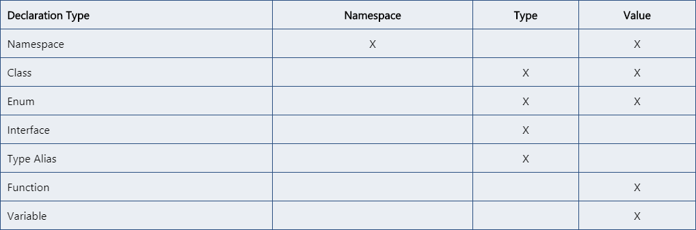

# 声明合并

[官方文档](https://www.tslang.cn/docs/handbook/declaration-merging.html)

编译器将针对同一个名字的两个独立声明合并为单一声明。 合并后的声明同时拥有原先两个声明的特性。 任何数量的声明都可被合并；不局限于两个声明。

```typescript
interface Info {
  name: string;
}

interface Info {
  age: number;
}

let info: Info

info = {
  name: 'jane',
}
// 'age' is declared here

info = {
  name: 'jane',
  age: 18,
}
```

TypeScript中的声明会创建以下三种实体之一：`命名空间`，`类型` 或 `值`。

* 创建命名空间的声明会新建一个命名空间，它包含了用（.）符号来访问时使用的名字。
* 创建类型的声明是：用声明的模型创建一个类型并绑定到给定的名字上。
* 创建值的声明会创建在JavaScript输出中看到的值。



## 合并接口

接口的非函数的成员应该是唯一的。如果它们不是唯一的，那么它们必须是相同的类型。如果两个接口中同时声明了同名的非函数成员且它们的类型不同，则编译器会报错。

```typescript
interface Info {
  name: string;
}

interface Info {
  name: number; // 续属性声明必须属于同一类型。属性“name”的类型必须为“string”，但此处却为类型“number”。
}

interface Info {
  name: string;
}
```

对于函数成员，每个同名函数声明都会被当成这个函数的一个重载。 同时需要注意，当接口 A与后来的接口 A合并时，后面的接口具有更高的优先级。

```typescript
interface Info {
  name: string;
  getRes(input: string): number;
}

interface Info {
  getRes(input: number): string;
}

let info: Info

info = {
  name: 'jane',
  getRes(text: any): any {
    if (typeof text === 'string') {
      return text.length
    } else {
      return String(text)
    }
  }
}
```

注意每组接口里的声明顺序保持不变，但各组接口之间的顺序是后来的接口重载出现在靠前位置。

这个规则有一个例外是当出现特殊的函数签名时。 如果签名里有一个参数的类型是 单一的字符串字面量（比如，不是字符串字面量的联合类型），那么它将会被提升到重载列表的最顶端。

```typescript
interface Document {
    createElement(tagName: any): Element;
}
interface Document {
    createElement(tagName: 'div'): HTMLDivElement;
    createElement(tagName: 'span'): HTMLSpanElement;
}
interface Document {
    createElement(tagName: string): HTMLElement;
    createElement(tagName: 'canvas'): HTMLCanvasElement;
}
```

合并后：

```typescript
interface Document {
    createElement(tagName: 'canvas'): HTMLCanvasElement;
    createElement(tagName: 'div'): HTMLDivElement;
    createElement(tagName: 'span'): HTMLSpanElement;
    createElement(tagName: string): HTMLElement;
    createElement(tagName: any): Element;
}
```

## 合并命名空间

与接口相似，同名的命名空间也会合并其成员。

对于命名空间的合并，模块导出的同名接口进行合并，构成单一命名空间内含合并后的接口。

对于命名空间里值的合并，如果当前已经存在给定名字的命名空间，那么后来的命名空间的导出成员会被加到已经存在的那个模块里。

```typescript
namespace Validation {
  export const checkNumber = () => {}
}

namespace Validation {
  export const checkLetter = () => {}
}

// 合并
namespace Validation {
  export const checkNumber = () => {}
  export const checkLetter = () => {}
}
```

非导出成员仅在其原有的（合并前的）命名空间内可见。

```typescript
namespace Validation {
  const name = 'jane'
  export function getNameA() {
    return name
  }
}

namespace Validation {
  export function getNameB() {
    return name // Error, because name is not accessible here
  }
}
```

## 命名空间与类合并

这让我们可以表示内部类。 声明时，类一定要在命名空间前面。

```typescript
class Validation {
  constructor() {}
  public checkType() {}
}

namespace Validation {
  export const numberReg = /^[0-9]+$/
}

console.dir(Validation)
```

## 命名空间和函数合并

```typescript
function countUp() {
  countUp.count++
}

namespace countUp {
  export let count = 0
}

countUp.count // 0
countUp()
countUp.count // 1
```

## 命名空间和枚举合并

```typescript
enum Colors {
  red,
  green,
  blue,
}

namespace Colors {
  export let yellow = 3
}

// {0: "red", 1: "green", 2: "blue", red: 0, green: 1, blue: 2, yellow: 3}
```

TypeScript并非允许所有的合并。 目前，类不能与其它类或变量合并。
