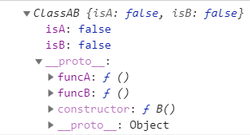

# 混入

[官方文档](https://www.tslang.cn/docs/handbook/mixins.html)

## 对象的混入

在 javascript 中，可以使用 `Object.assign` 来实现对象的混入

```javascript
let a = {
  a: 'a'
}

let b = {
  b: 'b'
}

Object.assign(a, b)

// a
{
  a: 'a',
  b: 'b'
}

// b
{
  b: 'b'
}
```

在 typesscript 中同样也是可以的：

```typescript
interface A {
  name: string;
}
let Aa: A = {
  name: 'jane',
}

interface B {
  age: number;
}
let Bb: B = {
  age: 18,

}
Object.assign(A, B)

// Aa
{name: "jane", age: 18}

// Bb
{age: 18}
```

## 类的混入

在 Javascript 中实现类的混入:

```javascript
class A {
  funcA () {
    console.log('A here')
  }
}

class B {
  funcB () {}
}

function mixins(target, from) {
  Object.getOwnPropertyNames(from).forEach(key => {
    target[key] = from[key]
  })
}

mixins(B.prototype, A.prototype)

let b = new B()
```

在 typescript 中的实现类的混入：

```typescript
class A {
  public isA: boolean
  public funcA() {}
}

class B {
  public isB: boolean
  public funcB() {}
}

class ClassAB implements A, B {
  public isA: boolean = false
  public isB: boolean = false
  public funcA: () => void
  public funcB: () => void
  constructor() {}
}

function mixins(base: any, from: any[]) {
  from.forEach(fromItem => {
    Object.getOwnPropertyNames(fromItem.prototype).forEach(key => {
      base.prototype[key] = fromItem.prototype[key]
    })
  })
}

mixins(ClassAB, [A, B])

let ab = new ClassAB()
```

结果：


